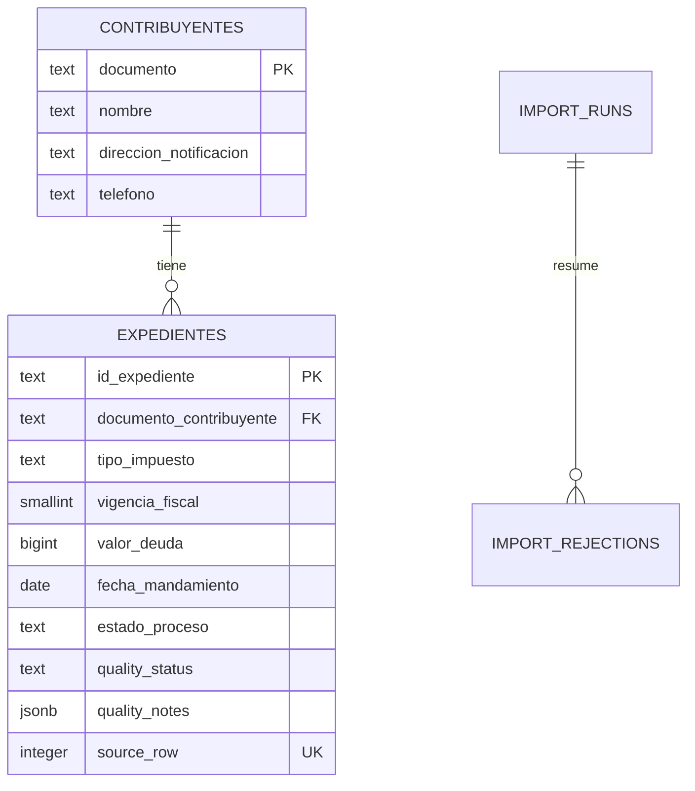

# Cobro Claro · Expedientes de Chía

Aplicación web para importar, consultar, editar y reportar los expedientes de cobro entregados en `expedientes_cobro_chia.csv`. La solución prioriza la trazabilidad: ninguna fecha, deuda, identidad o duplicado contradictorio se corrige por suposición.

> Estado del entregable: aplicación, migración, semilla, pruebas, documentación y publicación terminadas.

## Enlaces del entregable

- Aplicación en Vercel: [cobro-claro-chia.vercel.app](https://cobro-claro-chia.vercel.app)
- Repositorio público: [github.com/EstebanVanegasP/cobro-claro-chia](https://github.com/EstebanVanegasP/cobro-claro-chia)

## Alcance implementado

- Importación reproducible del CSV con normalización, validación, rechazos y auditoría.
- Listado paginado con búsqueda por expediente, documento o contribuyente.
- Vista de detalle individual.
- Edición validada de contribuyente y expediente mediante una operación transaccional en PostgreSQL.
- Reporte de deuda total por tipo de impuesto.
- Reporte de cantidad de expedientes por estado.
- Diez contribuyentes con mayor deuda acumulada, identificados por documento.
- Pantalla adicional de calidad de datos que hace visibles las reglas, cifras y filas no cargadas.
- Diseño adaptable a escritorio y móvil.

No se implementaron eliminación, autenticación ni filtros avanzados porque el enunciado los declara fuera de alcance.

## Tecnologías

- Next.js 16.3 con App Router, React 19 y TypeScript.
- Supabase (PostgreSQL, Data API, RLS y migraciones).
- Zod para validar la edición en el servidor.
- Vercel para alojamiento.
- Python estándar para el análisis y transformación reproducible del CSV.
- pnpm con versiones exactas y lockfile comprometido.

Todo funciona con los planes gratuitos solicitados.

## Cómo ejecutarlo

### Requisitos

- Node.js 24.x.
- pnpm 11 o superior.
- Python 3.11 o superior, necesario únicamente para analizar o regenerar los datos desde un CSV.
- Cuenta gratuita de Supabase.

### Aplicación local

```bash
pnpm install
cp .env.example .env.local
pnpm dev
```

Abre `http://localhost:3000`.

Sin variables de Supabase, la aplicación arranca con los artefactos procesados de `data/processed/` en modo local de solo lectura. Este modo facilita la revisión, pero no reemplaza la base exigida. Para consultar y editar la base real, completa:

```dotenv
NEXT_PUBLIC_SUPABASE_URL=https://<project-ref>.supabase.co
NEXT_PUBLIC_SUPABASE_PUBLISHABLE_KEY=sb_publishable_...
```

La clave publicable no es un secreto. La base habilita RLS y privilegios explícitos; no se usa una clave `service_role` en el navegador.

### Crear la base desde cero

La CLI utilizada para preparar el proyecto fue Supabase CLI 2.115.0. Los comandos se descubrieron con `--help` y no dependen de una instalación global:

```bash
pnpm dlx supabase login
pnpm dlx supabase link --project-ref <project-ref>
pnpm dlx supabase db push --linked --include-seed
```

El último comando aplica `supabase/migrations/20260820060722_create_collection_schema.sql` y carga `supabase/seed.sql`.

Para regenerar la semilla desde el CSV original:

```bash
python scripts/analyze_csv.py /ruta/expedientes_cobro_chia.csv --output data/quality_report.json
python scripts/transform_csv.py /ruta/expedientes_cobro_chia.csv --output-dir data/processed --seed supabase/seed.sql
pnpm test:data
```

### Despliegue en Vercel

La aplicación puede desplegarse directamente desde este repositorio mediante la integración Git de Vercel.

1. Importar el repositorio en Vercel.
2. Seleccionar **Next.js** como framework. Vercel normalmente lo detecta automáticamente.
3. Configurar las siguientes variables de entorno para el ambiente de producción:

```dotenv
NEXT_PUBLIC_SUPABASE_URL=https://<project-ref>.supabase.co
NEXT_PUBLIC_SUPABASE_PUBLISHABLE_KEY=sb_publishable_...
```

4. Configurar `main` como rama de producción.
5. Ejecutar el despliegue.

La aplicación publicada consulta directamente los datos almacenados en Supabase. Por lo tanto, una actualización de los registros en la base de datos no requiere un nuevo despliegue de Vercel, salvo que también haya cambios en el código o en los artefactos locales utilizados como fallback.

Después del despliegue se recomienda verificar al menos las siguientes rutas:

```text
/
/expedientes
/reportes
/calidad-datos
```

### Actualización de datos desde un nuevo CSV

Cuando se reciba una nueva versión completa del archivo fuente, el pipeline puede ejecutarse nuevamente sin modificar manualmente las reglas de transformación.

Primero se genera el perfil de calidad:

```bash
python scripts/analyze_csv.py /ruta/nuevo_archivo.csv --output data/quality_report.json
```

Después se ejecuta la transformación:

```bash
python scripts/transform_csv.py /ruta/nuevo_archivo.csv --output-dir data/processed --seed supabase/seed.sql
```

El proceso regenera:

```text
data/quality_report.json
data/processed/expedientes.json
data/processed/rejections.json
data/processed/summary.json
supabase/seed.sql
```

Antes de cargar los nuevos datos se recomienda ejecutar:

```bash
pnpm test:data
pnpm typecheck
pnpm lint
pnpm build
```

Si las validaciones son satisfactorias, el `supabase/seed.sql` generado puede ejecutarse sobre el proyecto Supabase correspondiente.

La aplicación desplegada en Vercel consulta Supabase directamente, por lo que los nuevos datos estarán disponibles en la aplicación una vez actualizada la base de datos.

### Estrategia de carga

> **Importante:** el pipeline implementado actualmente utiliza una estrategia de **reemplazo completo (`full refresh`)**, no una carga incremental.

Cada CSV procesado debe representar la fotografía completa del conjunto de datos que se desea mantener en la aplicación.

El `seed.sql` generado elimina la carga anterior de las tablas operativas antes de insertar los registros provenientes del nuevo archivo procesado.

Por lo tanto:

```text
CSV completo actualizado
        ↓
Transformación
        ↓
Validación
        ↓
Reemplazo de carga anterior
        ↓
Nueva versión de los datos en Supabase
```

No debe utilizarse directamente un archivo que contenga únicamente registros nuevos o incrementales, ya que los registros existentes que no estén presentes en dicho CSV dejarían de formar parte de la carga.

Si en el futuro la fuente entrega archivos incrementales, será necesario implementar una estrategia diferente, por ejemplo `UPSERT`, control de versiones o procesamiento basado en identificadores y fechas de actualización.

### Verificaciones

```bash
pnpm test:data
pnpm typecheck
pnpm lint
pnpm build
```

También existe una suite Python más detallada:

```bash
python -m unittest discover -s tests -p "test_*.py"
```

### Verificación operativa

Una instalación o actualización se considera satisfactoria cuando:

- `pnpm test:data` finaliza correctamente.
- `pnpm typecheck` no reporta errores.
- `pnpm lint` no reporta errores bloqueantes.
- `pnpm build` genera correctamente el build de producción.
- Supabase contiene los registros esperados en `contribuyentes`, `expedientes`, `import_runs` e `import_rejections`.
- La aplicación indica **“Supabase conectado”** como fuente de datos.
- El total de expedientes y rechazos mostrado en la aplicación coincide con `data/processed/summary.json`.
- Las rutas principales `/`, `/expedientes`, `/reportes` y `/calidad-datos` cargan correctamente.

## Estructura de datos

El grano del archivo fuente es una fila por expediente. En la base separé la identidad del contribuyente del proceso de cobro para no repetir nombre y datos de contacto en cada deuda.



- `contribuyentes`: identidad por documento normalizado y contacto opcional.
- `expedientes`: datos del proceso, deuda, origen y control de calidad.
- `import_runs`: balance y métricas de cada importación.
- `import_rejections`: fila, identificador candidato y motivos; no conserva el registro crudo completo.
- `expedientes_detalle`: vista `security_invoker` para la lectura de la aplicación y el respeto de RLS.
- `actualizar_expediente(...)`: función `security invoker` que actualiza las dos tablas en una sola transacción.

Los reportes agrupan contribuyentes por documento, no por nombre. Dos personas pueden llamarse igual; fusionarlas sin una identidad común inflaría la deuda y sería una decisión insegura.

## Reglas de depuración

Resultado reconciliado:

| Concepto | Filas |
|---|---:|
| Recibidas | 280 |
| Cargadas | 247 |
| No cargadas | 33 |
| Cargadas con observación | 22 |

Una fila puede fallar varias reglas, de modo que los conteos por motivo no necesariamente suman 33.

| Inconsistencia encontrada | Evidencia | Decisión |
|---|---:|---|
| Espacios, puntos, guiones, prefijo `C.C.` o dígito de verificación en documento | formatos heterogéneos; longitudes normalizadas de 8, 10 y 11 dígitos | Conservar únicamente dígitos. Aceptar longitudes entre 7 y 12; no calcular ni inventar dígitos. |
| Mayúsculas, dobles espacios y variantes de nombre | presente en todo el archivo | Colapsar espacios y usar presentación consistente; el documento sigue siendo la identidad. |
| Variantes `Predial`, `Predial unificado`, `ICA`, `Industria y comercio`, `Vehículos` | 10 valores crudos que representan 3 categorías | Mapear a tres valores canónicos. |
| Variaciones de estado por capitalización | 10 valores crudos más vacío | Unificar capitalización. El vacío se conserva como `Sin definir` y se marca con observación. |
| Moneda como entero, `$`, `COP`, puntos, apóstrofe y decimal `,00` | múltiples formatos | Convertir a pesos enteros solo cuando la interpretación es inequívoca. |
| Deuda vacía, `N/A`, cero o negativa | 4 motivos | Rechazar; cambiar el signo o imputar un monto alteraría la obligación. |
| Fecha ISO, con `/` o mes abreviado | 3 formatos válidos | Convertir a `YYYY-MM-DD`. |
| Fecha vacía, textual o imposible | 4 motivos | Rechazar; no inferir una fecha con efecto potencial sobre plazos. |
| Vigencia 2031, posterior a la fecha de la prueba | 5 motivos | Rechazar como vigencia futura. |
| Documento `SIN DATO` o `PENDIENTE` | 2 motivos | Rechazar; el nombre no sustituye una identidad. |
| Fila duplicada exacta | 9 filas | Conservar la primera aparición y auditar la repetición. |
| Mismo `id_expediente` con datos contradictorios | 9 filas | Rechazar todas las versiones del grupo: no existe evidencia para escoger una. |
| Dirección o teléfono vacíos | 73 y 33 registros aceptados | Conservar como `NULL`; el enunciado no los define como obligatorios. |

No apliqué una expresión rígida al `id_expediente`: el enunciado no especifica su patrón. Durante el análisis se consideró esa heurística, pero se descartó porque habría rechazado un identificador no estándar cuyo resto de datos sí era recuperable.

Los resultados completos y auditables están en:

- `data/quality_report.json`: perfil del archivo crudo.
- `data/processed/summary.json`: balance final y conteos.
- `data/processed/rejections.json`: filas no cargadas y causas.
- `data/processed/expedientes.json`: registros normalizados aceptados.

## Registros no cargados

Los 33 rechazos están enumerados en `data/processed/rejections.json` y en la pantalla **Calidad de datos**. Se excluyeron únicamente por uno o más de estos criterios:

- valor de deuda ausente, no numérico o no positivo;
- fecha de mandamiento ausente o imposible;
- documento ausente/no identificable;
- vigencia futura;
- duplicado exacto adicional;
- identificador duplicado con contenido contradictorio.

El archivo de rechazos guarda el número de fila original para que una persona pueda volver a la fuente y resolver el caso.

## Seguridad y decisiones de alcance

- RLS está habilitado en todas las tablas del esquema expuesto.
- Los `GRANT` son explícitos porque los proyectos nuevos de Supabase ya no exponen automáticamente tablas nuevas a la Data API.
- La vista usa `security_invoker = true`.
- La función de edición revoca `EXECUTE` de `PUBLIC` y se concede solo a `anon`, de acuerdo con el alcance sin autenticación.
- No se expone una clave secreta ni `service_role`.
- No existen privilegios públicos de inserción ni eliminación.
- La edición es pública porque la prueba declara autenticación fuera de alcance. En producción agregaría Supabase Auth, roles municipales y una bitácora inmutable antes de permitir cambios sobre datos reales.

## Lo que dejé pendiente

- Autenticación, autorización por rol y auditoría por usuario.
- Importación desde la interfaz; hoy la carga es un proceso reproducible de administración para evitar que cualquier visitante escriba lotes en la base.
- Pruebas end-to-end de la edición contra una rama temporal de Supabase.
- Paginación y agregaciones ejecutadas en SQL para volúmenes mayores. Con 247 filas, cargar hasta 1.000 registros y agrupar en el servidor de Next.js es simple y verificable.
- Mejorar la normalización de direcciones y validar teléfonos contra reglas colombianas con una fuente oficial. No se hizo porque una regla apresurada podía destruir información.

## Uso de inteligencia artificial

Usé Codex como compañero de análisis e implementación.

### Qué le pedí

- Separar mi solicitud de las instrucciones contenidas en el PDF.
- Revisar visualmente el enunciado completo y perfilar el CSV.
- Proponer una arquitectura gratuita con Next.js, Supabase, GitHub y Vercel.
- Construir la interfaz, migración, semilla, pruebas y documentación.
- Verificar el build y navegar las rutas en escritorio y móvil.

### Qué propuso

- Normalizar contribuyentes y expedientes en tablas separadas.
- Crear una bitácora de importación y rechazos.
- Usar una política conservadora para datos con impacto legal.
- Implementar la edición como función transaccional y no como dos llamadas independientes.
- Añadir un modo local de solo lectura y una pantalla de calidad de datos para facilitar la evaluación.

### Qué revisé o cambié y por qué

- Rechacé una primera heurística que exigía `EXP-AAAA-NNNN` porque el enunciado no define ese formato; no era válido inventar una regla de negocio.
- Elegí documento normalizado, y no nombre, para acumular deuda por contribuyente.
- Decidí rechazar todas las filas de un identificador contradictorio en vez de conservar “la primera” o “la de mayor deuda”.
- Conservé estados vacíos como observación, pero no inventé su etapa.
- Mantuve dirección y teléfono como opcionales.
- Ajusté contraste y desbordes después de revisar capturas y ejecutar una auditoría WCAG; no acepté el primer render como terminado.

La IA aceleró el trabajo mecánico, pero las reglas finales se justifican con el enunciado, el perfil cuantitativo y el riesgo de alterar una obligación de cobro.

## Estructura del repositorio

```text
src/app/                 rutas, páginas y Server Action
src/components/          navegación e indicadores reutilizables
src/lib/                 acceso a datos, tipos y formato
scripts/                 perfil, transformación y control del resultado
tests/                   pruebas de la normalización y del balance
data/processed/          evidencia reproducible y fallback local
supabase/migrations/     esquema, restricciones, RLS y función de edición
supabase/seed.sql        247 expedientes, 238 contribuyentes y 33 rechazos
```
